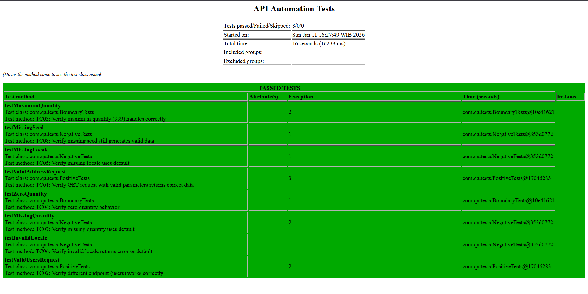

# API Automation Testing - Faker API

This project demonstrates automated API testing using Java, REST Assured, and TestNG framework. It includes 8 comprehensive test scenarios covering positive, negative, and boundary test cases.
git 
## 📋 Table of Contents
- [Technologies Used](#technologies-used)
- [Project Structure](#project-structure)
- [Prerequisites](#prerequisites)
- [Installation & Setup](#installation--setup)
- [Running Tests](#running-tests)
- [Test Scenarios](#test-scenarios)
- [Design Pattern](#design-pattern)
- [Test Reports](#test-reports)

---

## 🛠 Technologies Used

- **Java 11** - Programming Language
- **Maven** - Build & Dependency Management
- **REST Assured** - API Testing Library
- **TestNG** - Test Framework
- **Jackson** - JSON Parsing
- **Hamcrest** - Assertion Library

---

## 📁 Project Structure

```
api-automation/
├── pom.xml                          # Maven configuration
├── testng.xml                       # TestNG suite configuration
├── README.md                        # This file
└── src
    ├── main/java/com/qa
    │   ├── base
    │   │   └── BaseTest.java        # Base test configuration
    │   ├── models
    │   │   ├── Address.java         # Address POJO model
    │   │   └── AddressResponse.java # Response POJO model
    │   └── utils
    │       └── APIValidator.java    # Reusable validation utilities
    └── test/java/com/qa/tests
        ├── PositiveTests.java       # TC01-02: Positive test cases
        ├── BoundaryTests.java       # TC03-04: Boundary test cases
        └── NegativeTests.java       # TC05-08: Negative test cases
```

---

## ✅ Prerequisites

Make sure you have the following installed:

1. **Java JDK 11 or higher**
   ```bash
   java -version
   # Should show: java version "11.x.x" or higher
   ```

2. **Maven 3.6 or higher**
   ```bash
   mvn -version
   # Should show: Apache Maven 3.x.x
   ```

3. **IDE** (Choose one)
   - VS Code (you already have this!)
   - IntelliJ IDEA Community Edition
   - Eclipse

4. **VS Code Extensions** (if using VS Code)
   - Extension Pack for Java
   - Test Runner for Java
   - Maven for Java

---

## 🚀 Installation & Setup

### Step 1: Clone or Create Project

```bash
# Create project directory
mkdir api-automation
cd api-automation
```

### Step 2: Create Project Files

1. Copy the `pom.xml` file to project root
2. Copy the `testng.xml` file to project root
3. Create the folder structure:

```bash
# For Windows (PowerShell)
New-Item -ItemType Directory -Force -Path src/main/java/com/qa/base
New-Item -ItemType Directory -Force -Path src/main/java/com/qa/models
New-Item -ItemType Directory -Force -Path src/main/java/com/qa/utils
New-Item -ItemType Directory -Force -Path src/test/java/com/qa/tests

# For Mac/Linux (Terminal)
mkdir -p src/main/java/com/qa/{base,models,utils}
mkdir -p src/test/java/com/qa/tests
```

4. Copy all Java files to their respective folders

### Step 3: Install Dependencies

```bash
# Download all dependencies
mvn clean install -DskipTests

# If successful, you'll see: BUILD SUCCESS
```

### Step 4: Open in VS Code

```bash
# Open project in VS Code
code .
```

---

## 🏃 Running Tests

### Run All Tests

```bash
# Method 1: Using Maven
mvn clean test

# Method 2: Using TestNG XML
mvn test -DsuiteXmlFile=testng.xml
```

### Run Specific Test Class

```bash
# Run only positive tests
mvn test -Dtest=PositiveTests

# Run only boundary tests
mvn test -Dtest=BoundaryTests

# Run only negative tests
mvn test -Dtest=NegativeTests
```

### Run Specific Test Method

```bash
# Run a single test case
mvn test -Dtest=PositiveTests#testValidAddressRequest
```

### Run from VS Code

1. Open any test file (e.g., `PositiveTests.java`)
2. Click the ▶️ icon next to the test method
3. Select "Run Test" or "Debug Test"

---

## 📝 Test Scenarios

### ✅ Positive Tests

| Test Case | Description | Expected Result |
|-----------|-------------|-----------------|
| **TC01** | Valid address request with all parameters | Status 200, 2 addresses returned, locale=id_ID |
| **TC02** | Valid users request (different endpoint) | Status 200, 5 users returned, locale=en_US |

### ⚠️ Boundary Tests

| Test Case | Description | Expected Result |
|-----------|-------------|-----------------|
| **TC03** | Maximum quantity (999) | Status 200, handles large dataset |
| **TC04** | Zero quantity | Status 200 with empty array OR 400 error |

### ❌ Negative Tests

| Test Case | Description | Expected Result |
|-----------|-------------|-----------------|
| **TC05** | Missing locale parameter | Status 200, uses default locale |
| **TC06** | Invalid locale (INVALID_XX) | Status 400/422 OR falls back to default |
| **TC07** | Missing quantity parameter | Status 200, uses default quantity |
| **TC08** | Missing seed parameter | Status 200, generates random valid data |

---

## 🏗 Design Pattern

This project follows the **Page Object Model (POM)** adapted for API testing:

### 1. **Base Layer** (`BaseTest.java`)
- Contains common setup and configuration
- Provides reusable helper methods
- Manages RestAssured configuration

### 2. **Model Layer** (POJO classes)
- `Address.java` - Represents address object
- `AddressResponse.java` - Represents API response
- Uses Jackson annotations for JSON mapping

### 3. **Utility Layer** (`APIValidator.java`)
- Reusable validation methods
- Centralized assertion logic
- Follows DRY (Don't Repeat Yourself) principle

### 4. **Test Layer** (Test classes)
- Organized by test type (Positive, Boundary, Negative)
- Each test is independent and can run standalone
- Uses TestNG annotations for test orchestration

---
## Test Results
   
   All 8 test cases passed successfully:
   
   
   
   ### Test Summary
   - ✅ Tests Run: 8
   - ✅ Passed: 8
   - ❌ Failed: 0
   - ⏭️ Skipped: 0
```


## 👤 Author

**Ghazian Milzam Syazili**

---

## 📄 License

This project is created for technical assessment purposes.

---


**Happy Testing! 🎯**